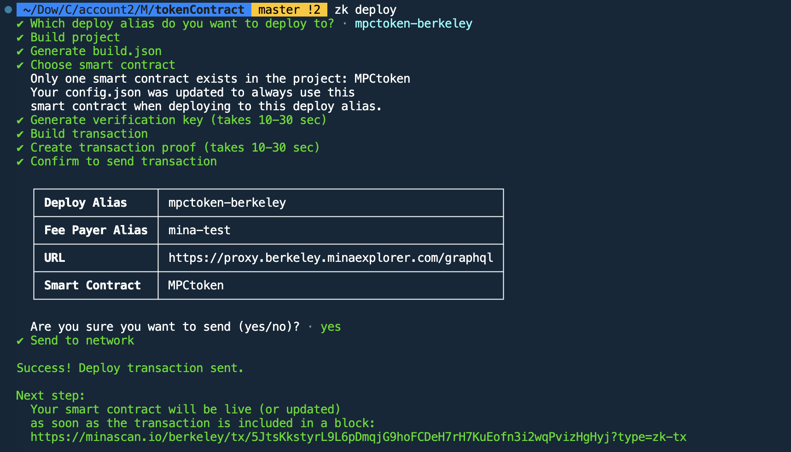

# Mina zkApp: Tokencontract

## MPCFaucet Repo - https://github.com/MinaPoker/MPCfaucet
(Adding link here as i have missed it on submission form for easy look)

This is repo for creating a MPC token. It includes a simple token contract that can be used as a starting point for creating your own zkApp.


## How to build

```sh
npm run build
```

## How to run tests

```sh
npm run test
npm run testw # watch mode
```

## How to run coverage

```sh
npm run coverage
```

## License

[Apache-2.0](LICENSE)


## Deployed Contract
 
 <!-- add a image -->
     


